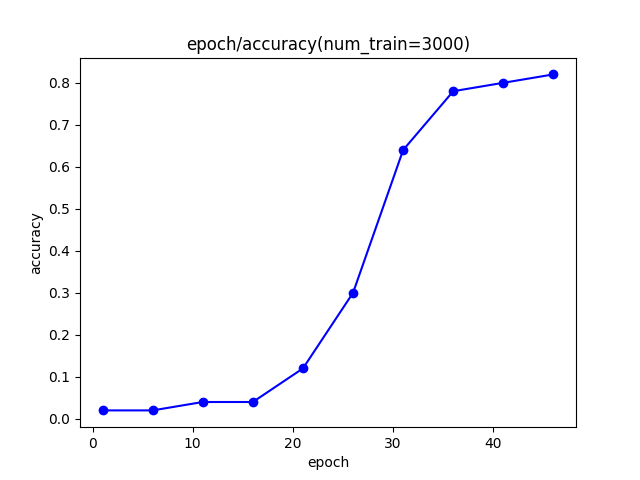
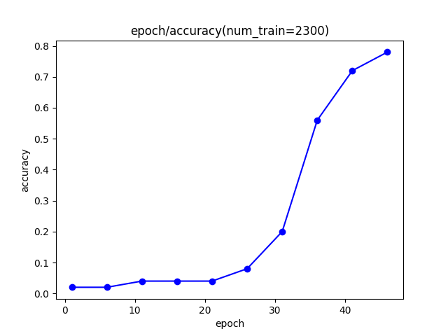

# 任务背景
Transformer是基于编码器-解码器的模型架构，结合交差注意力机制处理序列问题，在Seq2Seq任务上速度快、效果好，且解决了RNN容易遗忘最早信息的问题。但是，在处理文本生成任务时，transformer的交叉注意力机制略显冗余，不如单层的自注意力机制易训练、性能好。因此，像GPT等decoder-only架构的语言模型出现。本任务以简单的多位数加法为例，练习transformer架构模型的编写与训练，并对比其与decoder-only架构模型的性能。
[本项目的代码仓库](https://github.com/Crnaneo/FudanNLP_Task3-1.git)
# 方法实践
## 数据生成
使用python自动脚本生成训练集和测试集数据，前补0至相同长度便于模型捕捉固定的位置信息。同时在训练之前对其预处理，在答案部分添加`<SOS>`和`<EOS>`标签作起止符。
## 词向量化
因为只有数字和+, =,`<SOS>`, `<EOS>`符号，词表较小，可以手工定义词表。同时增加`<PAD>`填充符。tokenize时，一个字符为一个token，映照为数字。
对于embedding层，按照transformer的规范，定义token_embedding和position_embedding对应词向量和位置向量。随机化向量后按照 $token\_embedding\times\sqrt{d_m}+ position\_embedding$进行向量拼接。
## 模型定义
初始化定义模型的embedding层和模型结构，分别使用pytorch封装的完整transformer和多层Encoder+多层Decoder拼接手动构造transformer。并将两个transformer与decoder-only进行对比。
初始化时，需要设定注意力头数量、词向量维度、层数，FFN维度，输出维度。在使用decoder-only时，为避免交叉注意力对模型的影响，选择只接收一层输入的transformer encoder作decoder。
在模型前向传播阶段，需要先定义padding-mask，避免模型注意那些填充。再利用transformer和线性层两层映射传播。
## 训练
使用Adam优化器、交叉熵函数、动态学习率。在完整transformer的情况下，分别用问题和答案作为encoder和decoder的输入，在decoder-only的情况下，将完整的问题+答案作为输入，但问题部分不计算损失。
在训练阶段，为了让训练过程更符合加法从个位开始的计算顺序，选择让模型倒序生成答案。这样模型能更好学习进位方法。
## 测试
模型使用自回归生成答案，生成到`<EOS>`字符则自动停止，设置最大输出长度防止进入死循环。输出最终准确率
# 实验设计
## 对比标准Transformer和Decoder-Only在该任务的性能差异
传统transformer善于处理seq2seq任务，decoder-only在文本续写，序列生成任务上表现较好。实验希望对比在相同的输入512维，FFN2048维的参数情况下，两种模型在多位数加法的表现差异。
## 测试模型在训练过程中随epoch变化在验证集上表现变化
调整数据发现，模型在计算五位数加法时，当训练集样本数为1800-2000（decoder-only）时，模型表现有明显增加(约20%提升至70%)，因此希望尝试在进行训练时，数据量在什么情况下模型会出现这样的顿悟。因此选择增加验证集，在训练过程中测试模型的表现，看在训练的什么阶段模型会出现顿悟现象。
# 测试模型在答案不翻转、前无补0情况下的表现变化
为保证transformer能更好捕捉数字序列、加法模式的特征，在训练、测试过程中对所有算式的数字前补0至固定位数，同时让模型倒序输出结果。为测试这样的优化对模型性能提升有多少，考虑分别不做上面两种操作、测试模型表现
# 结果分析
## 实验1
实验基于epochs = 50;  batch_size=32; lr初始为1e-4; 训练集样本1900的参数进行。
*选择这个训练集大小是因为此时decoder-only尚未完全顿悟、与transformer差异较大，比较好对比*
在decoder-only模型中，最终loss约为0.45、准确率约为0.35；在transformer模型中，最终loss约为0.10，准确率约为0.80。在30-35个epoch的时候模型开始顿悟。可见decoder-only模型相比transformer更晚出现顿悟，在较少训练次数时表现较差。但是当训练集样本增多时，同样epoch的情况下两个模型均表现优异、差别小。
可见decoder-only相比transformer在这样的Seq2Seq任务中，更慢捕捉文本核心特征，训练效果相对较差，但二者上限接近。
## 实验2
实验基于epochs = 50;  batch_size=32; lr初始为1e-4; ，在decoder-only模型上进行。

图1：验证集准确率随epoch的变化（训练集样本数为3000）

图2：验证集准确率随epoch的变化（训练集样本数为2300）

可见，在训练集3000条数据时训练30轮、2300条数据时训练35轮左右模型会出现顿悟，准确率从0.2骤增至0.6左右。此时训练数据大概在90000条左右。通过这个实验，可知大概模型在此参数下训练90000条左右的数据，模型便可以达到较好的水平，可根据此结果对训练集大小和epochs进行适当调整提高效率
# 实验3
实验基于epochs = 50;  batch_size=32; lr初始为1e-4; 训练集大小为2500，在transformer模型上进行。
首先测试前不补0，此时模型在测试集准确率只有0.1，远低于有补0的95%左右。
再测试不倒序生成，在测试集准确率为0.85左右，表现略差。
可见transformer的位置编码对序列处理极为重要，若模型不能借助位置编码识别数位信息，则模型表现会显著变差。相比起来加法运算的进位模式重要性较小，模型仍能总结出序列特征。

# 总结
Transformer这种适配Seq2Seq架构的模型适合处理多位数加法这种序列生成任务。为保证好的训练效果，需要对数字前补0至固定位数、并将答案倒转。这样transformer才能有效利用位置向量捕捉数位信息，并掌握进位运算。
多位数加法为Seq2Seq任务，不是序列补充任务，因此传统Transformer能更好处理这个任务，在较小的训练次数上获得较好的成果。
在这个任务中，模型的顿悟表现较明显，可以通过测试获得这个阈值，以调整训练集的大小、epochs数量，以尽可能提高训练效率